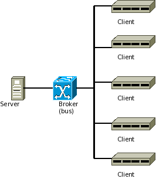
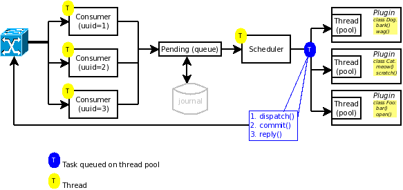
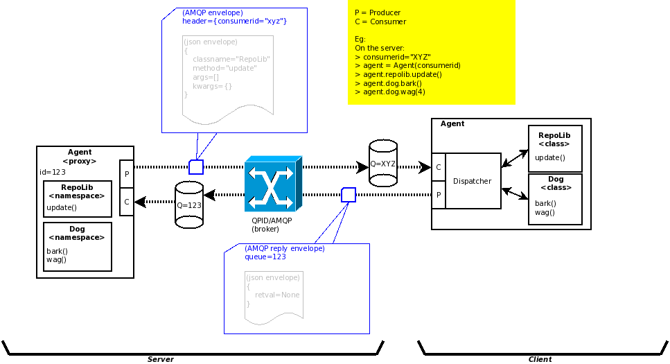
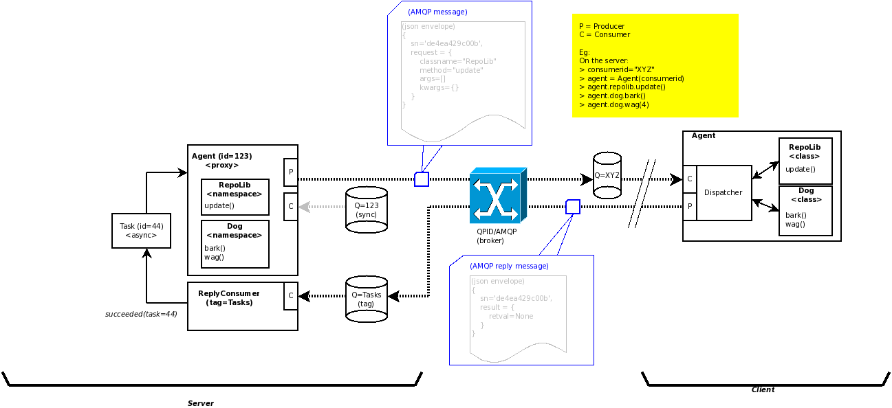

Design
======

Approach
^^^^^^^^

The preferred approach is to leverage a Message Bus and possibly a Messaging Framework
that uses the message bus for transport. The advantages over home grown and/or
point-to-point solutions are as follows:

- Hub and Spoke topology. Each node knows the address of the broken but not each other.
- Key-based routing. Nodes are associated with properties instead of IP addresses.
- Reliable message delivery.
- Message queueing.
- Automatic reconnect behaviour.
- And probably others ...

Dispatch Architecture:

Messaging
^^^^^^^^^

A Messaging Framework provides RMI (Remote Method Invocation) & Event semantics on top of messaging.
This gives application developers an easy to use abstraction and hides some of the complexities of
exchange and dispatching. Especially in OO applications, invoking a method remotely on an agent
without regard for message exchange and routing enhances reliability and productivity.

Compatibility:

- Uses new ​QPID Messaging API.
- ​QPID 0.5+
- ​MRG 3.1+

Requirements Summary:

- Key-based routing based on consumer ID.
- Synchronous RMI.
- Asynchronous RMI.
- Fire and Forget
- Callbacks
- Returned values.
- Exception propagation.
- Easy to use.
- Easy to extend classes/method exposed for RMI.
- Support Maintenance Windows - messages have effective date & time.
- Support fan out or multicast - sending messages to multiple consumers (system groups).
- Events
- Support multiple API versions.

Synchronous RMI:
----------------

Asynchronous RMI:
-----------------

Messages
--------

The message format is json:

- Envelope:
   - **sn** - Serial Number (uuid)
   - **version** - The API version.
   - **routing** - A tuple containing the amqp (sender, destination).
   - **window** - The window, date/time UTC window in which the message is valid.
   - **secret** - The (optional) shared secret used for request authentication.
   - **pam** - The (optional) PAM authentication credentials.
   - **replyto** - The reply amqp address (optional)
   - **(request|result|status|progress)** The payload.
       (request is type: Request, result is type: Result, status is type: string)
- Request (RMI):
   - **class** - The target class name.
   - **cntr** - The (optional) remote class constructor arguments. format: ([],{}).
   - **method** - The target instance method name.
   - **args[]** - The list of parameters passed to method
   - **kws{}** - The named keyword arguments passed to method.
- Result (RMI):
   - **retval** - The returned data (optional).
   - **retex** - The returned exception (optoinal).
- *Internal*:
   - **ts** - Timestamp injected when added to the journal.
   - **ttl** - Time-to-live (seconds) injected on receipt.
   - **transport** - The transport (package) on which the request was received.

Example RMI request message:

::

 {
    "sn": "e7e91fb6-611b-4284-a9ed-ac1636b2c709",
    "routing": [
        "cfa806a4-919a-495f-b1dd-3fc11be9a8d0" ,
        "19802a28-a18c-4ae3-ac57-b7a2e78a427a"
    ],
    "window":{},
    "replyto": "cfa806a4-919a-495f-b1dd-3fc11be9a8d0",
    "version": "0.2"
    "request": {
        "classname": "Dog",
        "method": "bark"
        "args": ["hello"],
        "kws": {}
    }
 }

Example reply:

::

 {
    "sn": "e7e91fb6-611b-4284-a9ed-ac1636b2c709",
    "origin":"123",
    "version": "0.2",
    "result": {
        "retval": "Yes master.  I will bark because that is what dogs do."
    }
 }

Example status reply:

::

 {
    "origin": "123",
    "status": "accepted",
    "version": "0.2",
    "sn": "985cb165-d291-47de-ab34-ecb20895384e",
    "any": "group 2"
 }

